# High Level Design: The Practical Guide to Thinking in Systems

High Level Design, usually called HLD, is the craft of turning a vague product idea into a system shape that engineers can reason about, build, scale, debug, and evolve.

It is not about drawing boxes for the sake of ceremony. A good HLD answers a simple question:

> If this system becomes real, what are its major parts, how do they talk, where can it fail, and how will it grow?

This blog is a fundamentals-first guide. It explains the core concepts intuitively, uses concrete examples, and includes diagrams you can mentally reuse in interviews, design reviews, architecture docs, and real production planning.

---

## 1. What High Level Design Really Means

Imagine you are designing a city.

You do not begin by choosing the color of every door handle. You first decide:

- Where people live.
- Where roads go.
- Where traffic bottlenecks may happen.
- Where water, power, and waste systems run.
- Where emergency services must be close.
- How the city can expand without collapsing.

Software HLD is similar. It focuses on the city map, not the door handle.

Low Level Design, or LLD, comes later. LLD asks how a class, function, database table, module, or API is implemented. HLD asks what the system is made of and how the important parts interact.

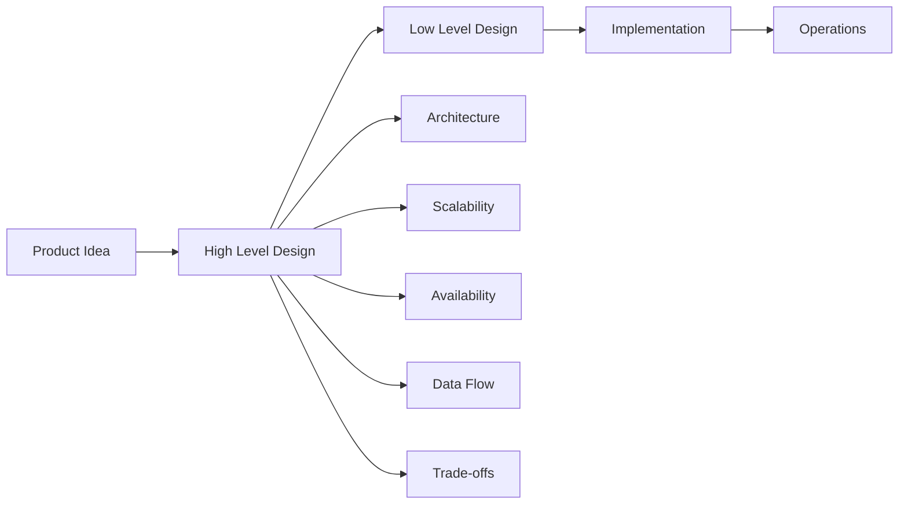

### HLD vs LLD

| Area | High Level Design | Low Level Design |
|---|---|---|
| Main question | What are the major components? | How is each component implemented? |
| Level | System and service level | Class, function, module, schema level |
| Focus | Scale, data flow, reliability, boundaries | Algorithms, interfaces, patterns, code structure |
| Example | Use cache before database | Implement LRU cache using hash map and doubly linked list |
| Audience | Architects, senior engineers, product, infra teams | Engineers implementing the feature |

The best engineers move comfortably between both levels. They can zoom out to see traffic across the city and zoom in to fix the traffic light.

---

## 2. The Core Mindset of HLD

A system exists to serve users under constraints.

That sentence contains nearly everything.

- **Users** create demand.
- **Constraints** create trade-offs.
- **The system** is the bridge between user expectations and real-world limits.

An HLD discussion should usually move through this order:

1. Clarify requirements.
2. Estimate scale.
3. Define APIs and data model.
4. Design the high-level architecture.
5. Identify bottlenecks.
6. Improve for scale, reliability, and cost.
7. Discuss trade-offs and future evolution.

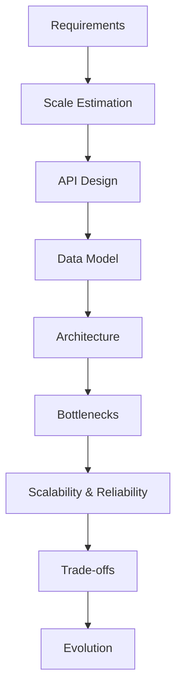

This order prevents a common mistake: jumping to Kafka, Redis, Kubernetes, or microservices before understanding the problem.

Tools are answers. Requirements are questions. Good design starts with questions.

---

## 3. Functional and Non-Functional Requirements

Every system has two kinds of requirements.

### Functional Requirements

Functional requirements describe what the system must do.

For a URL shortener:

- User can create a short URL.
- User can open the short URL and get redirected.
- User can optionally set expiry.
- User can view analytics.

Functional requirements are the visible behavior.

### Non-Functional Requirements

Non-functional requirements describe how well the system must behave.

- Latency: redirects should happen in less than 100 ms.
- Availability: system should be available 99.99% of the time.
- Scalability: must handle millions of redirects per day.
- Durability: created links should not disappear.
- Security: users should not hijack links.
- Cost: storage and compute should stay reasonable.

Non-functional requirements are where HLD becomes interesting.

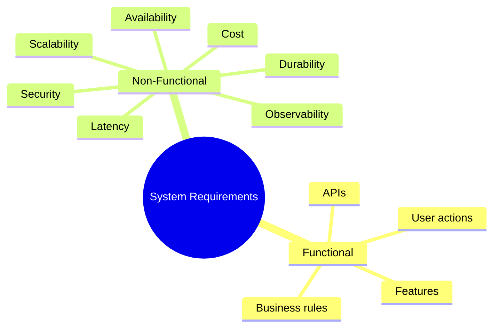

Most design trade-offs come from non-functional requirements. A prototype can satisfy functional requirements. A production system must satisfy both.

---

## 4. Capacity Estimation: The Math That Saves Architecture

Capacity estimation is not about perfect numbers. It is about developing system intuition.

Suppose a service has:

- 10 million daily active users.
- Each user performs 20 reads per day.
- Each user performs 2 writes per day.

Then:

- Daily reads = 200 million.
- Daily writes = 20 million.
- Reads per second = 200,000,000 / 86,400 = about 2,315 RPS.
- Writes per second = 20,000,000 / 86,400 = about 231 RPS.

But traffic is rarely flat. If peak traffic is 5x average:

- Peak reads = about 11,575 RPS.
- Peak writes = about 1,155 RPS.

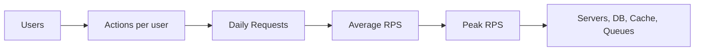

This simple chain changes architecture decisions.

If read traffic is much higher than write traffic, caching matters.
If write traffic is heavy, database partitioning and asynchronous processing matter.
If traffic is bursty, queues and autoscaling matter.

Capacity estimation tells you where the system will feel pressure.

---

## 5. Latency, Throughput, and Availability

Three words appear in almost every HLD conversation.

### Latency

Latency is how long one operation takes.

If a user opens a page and it takes 200 ms, that is latency.

### Throughput

Throughput is how many operations the system handles per unit of time.

If a service handles 10,000 requests per second, that is throughput.

### Availability

Availability is the percentage of time the system is usable.

99.9% availability sounds high, but it allows about 8.76 hours of downtime per year.

| Availability | Approximate Downtime Per Year |
|---|---:|
| 99% | 3.65 days |
| 99.9% | 8.76 hours |
| 99.99% | 52.6 minutes |
| 99.999% | 5.26 minutes |

These metrics interact.

You can improve latency with caching.
You can improve throughput with horizontal scaling.
You can improve availability with redundancy.
But every improvement has cost and complexity.

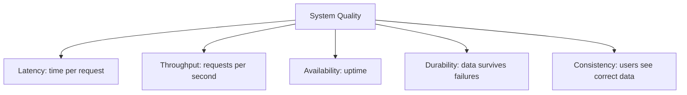

---

## 6. The Building Blocks of High Level Design

Most large systems are built from a familiar set of components. Learning these deeply is more useful than memorizing hundreds of architectures.

### 6.1 Client

The client is the user-facing application:

- Web browser.
- Mobile app.
- Desktop app.
- CLI.
- Third-party integration.

The client sends requests and receives responses.

### 6.2 DNS

DNS maps a human-readable domain like `example.com` to an IP address.

It is the internet's phonebook.

### 6.3 Load Balancer

A load balancer distributes traffic across multiple servers.

Without it, one server becomes overloaded while others sit idle.

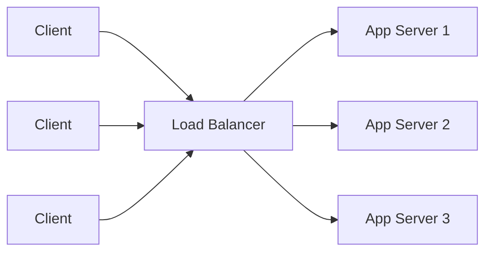

Load balancers also help with availability. If one server dies, traffic can be routed to healthy servers.

### 6.4 Application Server

Application servers contain business logic.

They:

- Validate requests.
- Authenticate users.
- Apply business rules.
- Call databases, caches, queues, and other services.
- Return responses.

Good HLD keeps application servers stateless when possible. Stateless servers are easier to scale because any server can handle any request.

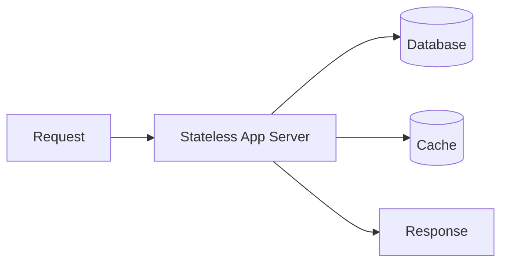

### 6.5 Database

The database stores durable data.

Common choices:

- Relational databases: PostgreSQL, MySQL.
- Document databases: MongoDB.
- Key-value stores: DynamoDB, Redis.
- Wide-column stores: Cassandra.
- Search databases: Elasticsearch, OpenSearch.
- Graph databases: Neo4j.

Database choice depends on access patterns.

Do not choose a database because it is fashionable. Choose it because it matches how the system reads and writes data.

### 6.6 Cache

A cache stores frequently accessed data in a faster layer.

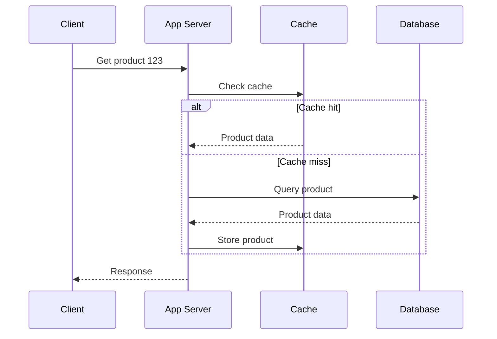

Caching improves latency and reduces database load.

But caching introduces questions:

- What is the TTL?
- What happens when data changes?
- Can stale data be tolerated?
- What happens if cache fails?

### 6.7 Message Queue

A queue decouples producers from consumers.

Instead of doing everything inside one user request, the system can enqueue work and process it asynchronously.

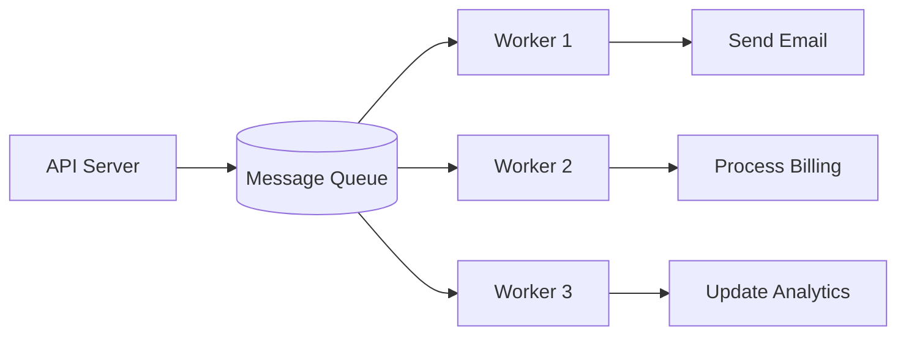

Queues are useful when:

- Work is slow.
- Work can be retried.
- Traffic is bursty.
- Producers and consumers should scale independently.

Examples:

- Send email after signup.
- Process uploaded video.
- Generate report.
- Update search index.
- Push analytics event.

### 6.8 CDN

A Content Delivery Network stores static content close to users.

Images, videos, CSS, JavaScript, and downloadable files are often served from a CDN.

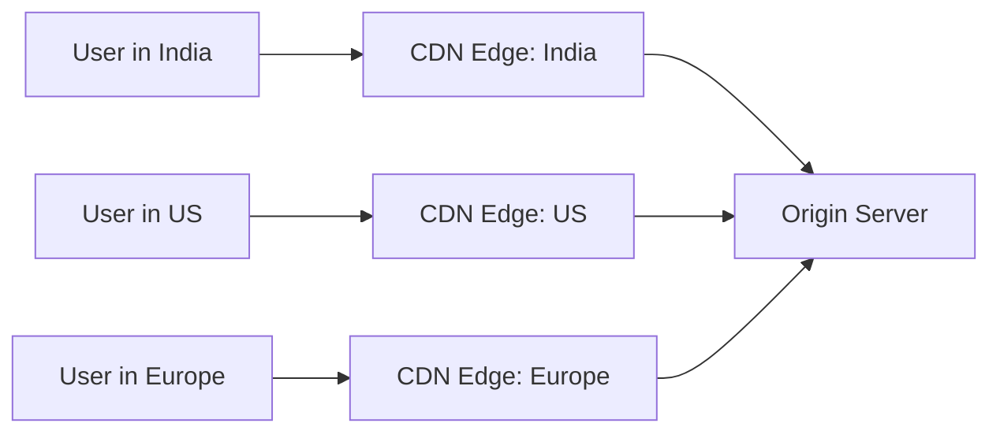

CDNs reduce latency and protect origin servers from huge static traffic.

### 6.9 Object Storage

Object storage stores large binary objects:

- Images.
- Videos.
- PDFs.
- Backups.
- Logs.
- ML datasets.

Application servers should usually not store files on their local disk. Local disk does not scale cleanly across many servers.

### 6.10 Search Index

Search systems are optimized for text search, filtering, ranking, and relevance.

You do not want to run expensive full-text search queries directly against the primary database at high scale.

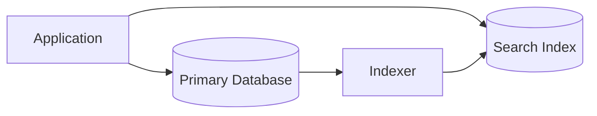

### 6.11 Observability

Production systems must explain themselves.

Observability includes:

- Logs: what happened.
- Metrics: how much and how often.
- Traces: where time was spent across services.
- Alerts: when humans should pay attention.

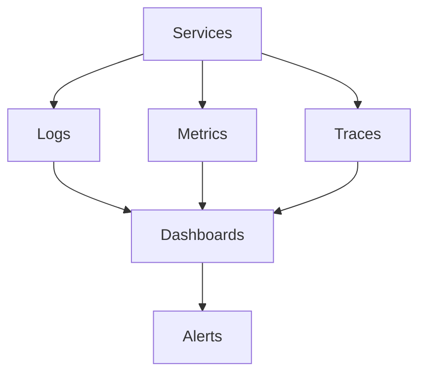

If you cannot observe a system, you cannot operate it confidently.

---

## 7. Scaling Fundamentals

Scaling means increasing system capacity.

There are two primary styles.

### Vertical Scaling

Vertical scaling means using a bigger machine.

Example:

- Move from 4 CPU cores to 32 CPU cores.
- Move from 16 GB RAM to 256 GB RAM.

It is simple but limited. Eventually, there is no bigger machine, or it becomes too expensive.

### Horizontal Scaling

Horizontal scaling means adding more machines.

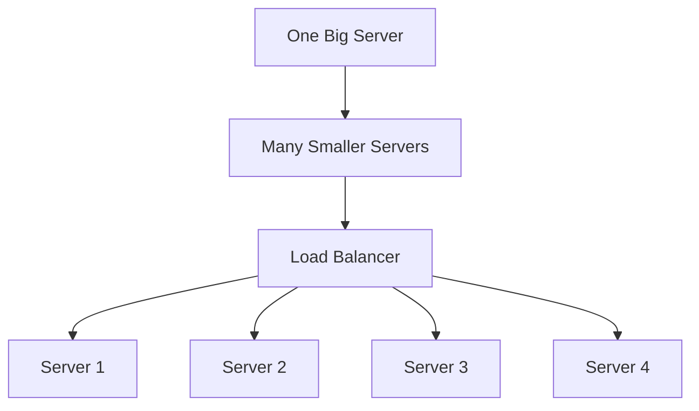

Horizontal scaling is more flexible but requires careful design:

- Servers should be stateless.
- Shared data should live in databases, caches, or object storage.
- Requests should be distributed evenly.
- Failures should be isolated.

---

## 8. Database Scaling

Databases are often the heart and the bottleneck of a system.

### 8.1 Read Replicas

Read replicas copy data from a primary database.

Writes go to primary. Reads can go to replicas.

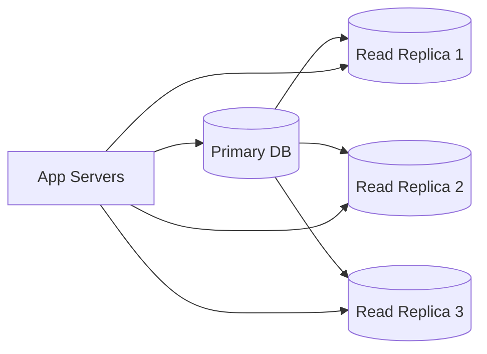

This helps read-heavy systems.

Trade-off: replicas may lag behind the primary. A user might write data and not immediately see it from a replica.

### 8.2 Partitioning

Partitioning splits a large table into smaller pieces.

Example: orders partitioned by month.

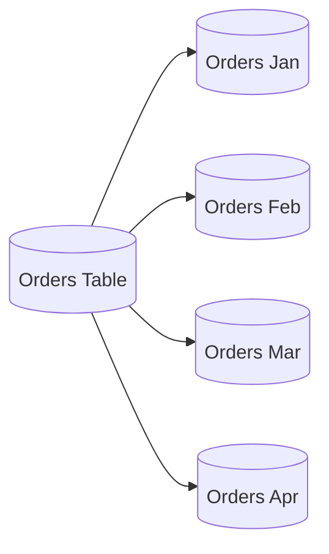

Partitioning helps with manageability and query performance when queries naturally target a subset of data.

### 8.3 Sharding

Sharding splits data across multiple database servers.

Example: users are assigned to shards by `user_id`.

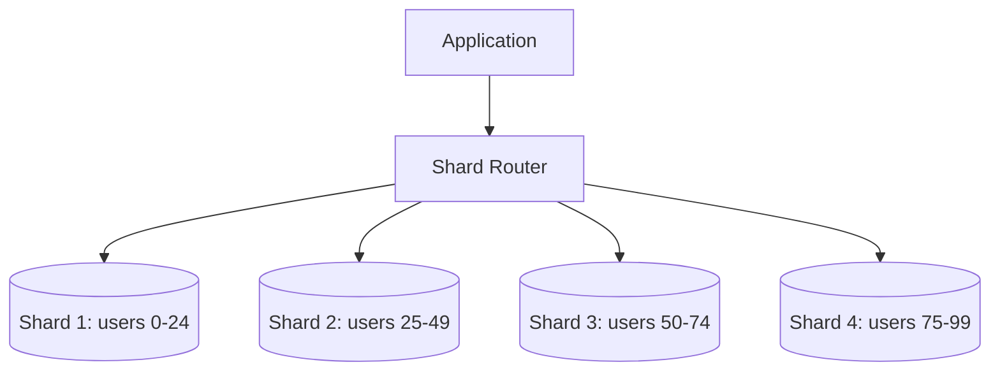

Sharding improves write capacity and storage capacity, but it makes the system more complex.

Common sharding problems:

- Hot shards.
- Cross-shard queries.
- Rebalancing data.
- Transactions across shards.
- Operational complexity.

Sharding is powerful medicine. Do not take it casually.

---

## 9. Consistency and Availability

Distributed systems force trade-offs.

One famous idea is the CAP theorem:

In the presence of a network partition, a distributed system must choose between consistency and availability.

### Consistency

Every read receives the most recent write.

### Availability

Every request receives a response, even if some nodes are down.

### Partition Tolerance

The system continues operating despite network splits or communication failures.

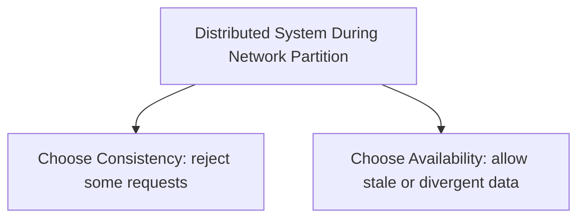

Real systems do not simply choose one forever. They choose differently for different features.

Examples:

- Banking ledger: prefer consistency.
- Social media likes count: can tolerate eventual consistency.
- Shopping cart: usually needs stronger consistency than product view count.
- Chat presence indicator: can be eventually consistent.

The art is not saying "consistency is good." The art is knowing where consistency is worth the cost.

---

## 10. Synchronous vs Asynchronous Communication

### Synchronous

The caller waits for the response.

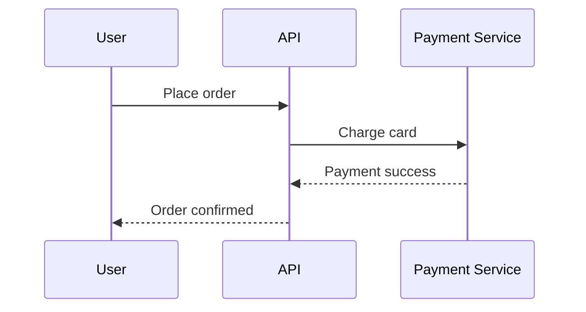

Use synchronous communication when the user needs the result immediately.

### Asynchronous

The caller sends a message and does not wait for all processing to finish.

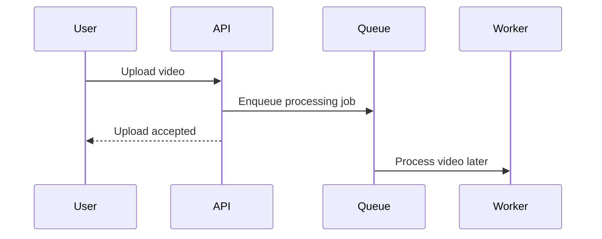

Use asynchronous communication when work can happen later:

- Email.
- Notification.
- Video processing.
- Analytics.
- Search indexing.
- Report generation.

Async systems are more scalable, but they introduce retry logic, duplicate message handling, ordering issues, and eventual consistency.

---

## 11. Reliability Patterns

Reliable systems assume failure.

Not "if failure happens." When failure happens.

### 11.1 Redundancy

Run multiple instances so one failure does not bring down the system.

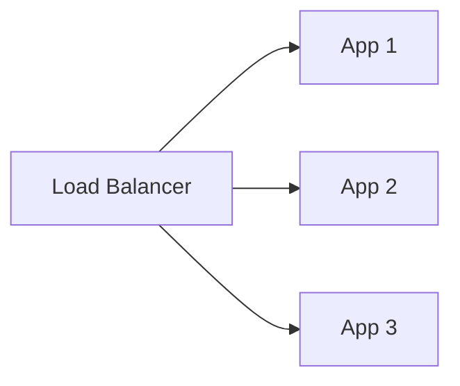

### 11.2 Timeouts

Never wait forever for another service.

Without timeouts, one slow dependency can freeze the whole system.

### 11.3 Retries

Retry transient failures.

But retries must be careful. If every service retries aggressively during an outage, traffic can multiply and make the outage worse.

Use:

- Exponential backoff.
- Jitter.
- Retry limits.
- Idempotency keys.

### 11.4 Circuit Breaker

A circuit breaker stops calling a failing dependency temporarily.

```mermaid
stateDiagram-v2
    [*] --> Closed
    Closed --> Open: Too many failures
    Open --> HalfOpen: Wait period ends
    HalfOpen --> Closed: Trial succeeds
    HalfOpen --> Open: Trial fails
```

This protects the caller from being dragged down by a failing service.

### 11.5 Bulkheads

Bulkheads isolate failures.

If image processing fails, checkout should still work.
If analytics is down, login should still work.

```mermaid
flowchart TD
    System[Application]
    System --> Critical[Critical Path]
    System --> NonCritical[Non-Critical Path]
    Critical --> Login[Login]
    Critical --> Checkout[Checkout]
    NonCritical --> Analytics[Analytics]
    NonCritical --> Recommendations[Recommendations]
```

---

## 12. Security in HLD

Security must be part of the architecture, not a final checklist.

Core concerns:

- Authentication: who are you?
- Authorization: what are you allowed to do?
- Encryption in transit: HTTPS/TLS.
- Encryption at rest: protected stored data.
- Secrets management: no hardcoded keys.
- Rate limiting: prevent abuse.
- Input validation: prevent injection.
- Audit logging: track sensitive actions.
- Data minimization: store only what is needed.

```mermaid
flowchart LR
    Client --> WAF[WAF / Edge Protection]
    WAF --> API[API Gateway]
    API --> Auth[Auth Service]
    Auth --> App[App Services]
    App --> DB[(Encrypted DB)]
    App --> Audit[(Audit Logs)]
```

Security is easiest when it is designed into the main flow.

---

## 13. API Design at the HLD Level

APIs are contracts between clients and systems.

For HLD, you do not need every field, but you should define core endpoints and request patterns.

Example for a URL shortener:

```http
POST /api/v1/links
GET /{shortCode}
GET /api/v1/links/{id}/analytics
DELETE /api/v1/links/{id}
```

Good API questions:

- Is this endpoint read-heavy or write-heavy?
- Does it need authentication?
- Is it idempotent?
- What are the rate limits?
- What happens on failure?
- Is the response cacheable?
- Does the API expose internal implementation details?

APIs should represent product behavior, not database tables.

---

## 14. Data Modeling at the HLD Level

Data modeling begins with access patterns.

Ask:

- What entities exist?
- How are they related?
- What queries are frequent?
- What queries are rare?
- What data must be strongly consistent?
- What data can be eventually consistent?

For an e-commerce system:

```mermaid
erDiagram
    USER ||--o{ ORDER : places
    ORDER ||--o{ ORDER_ITEM : contains
    PRODUCT ||--o{ ORDER_ITEM : appears_in
    USER ||--o{ CART : owns
    CART ||--o{ CART_ITEM : contains
    PRODUCT ||--o{ CART_ITEM : added_as
    PRODUCT ||--o{ INVENTORY : tracked_by
```

The data model must support the system's main workflows.

The most common mistake is designing the schema before understanding read/write patterns.

---

## 15. Example 1: Design a URL Shortener

A URL shortener maps a long URL to a short code.

Examples:

- Long: `https://example.com/articles/software/high-level-design/fundamentals`
- Short: `https://sho.rt/aB92xK`

### Requirements

Functional:

- Create short links.
- Redirect short links to original URLs.
- Support custom aliases.
- Support expiry.
- Track basic analytics.

Non-functional:

- Redirects should be very fast.
- Read traffic is much higher than write traffic.
- Links should be highly available.
- Analytics can be eventually consistent.

### Scale Assumption

Suppose:

- 10 million new links per month.
- 1 billion redirects per month.
- Redirect traffic is about 385 redirects per second on average.
- Peak may be 5x, about 1,925 redirects per second.

Reads dominate writes.

### Core Architecture

```mermaid
flowchart TD
    User[User Browser] --> DNS[DNS]
    DNS --> LB[Load Balancer]
    LB --> App[URL Service]
    App --> Cache[(Redis Cache)]
    App --> DB[(Link Database)]
    App --> Queue[(Analytics Queue)]
    Queue --> Worker[Analytics Worker]
    Worker --> AnalyticsDB[(Analytics Store)]
```

### Redirect Flow

```mermaid
sequenceDiagram
    participant U as User
    participant A as URL Service
    participant C as Cache
    participant D as Link DB
    participant Q as Analytics Queue

    U->>A: GET /aB92xK
    A->>C: Lookup aB92xK
    alt Cache hit
        C-->>A: Long URL
    else Cache miss
        A->>D: Query short code
        D-->>A: Long URL
        A->>C: Store mapping
    end
    A->>Q: Publish click event
    A-->>U: 302 Redirect
```

### Short Code Generation

Options:

1. Generate random Base62 code.
2. Use auto-increment ID and encode it as Base62.
3. Pre-generate codes and store them in a key pool.

Base62 uses:

- `a-z`
- `A-Z`
- `0-9`

With 7 characters, Base62 provides:

62^7 = about 3.5 trillion possible codes.

### Data Model

```text
links
- id
- short_code
- long_url
- user_id
- created_at
- expires_at
- status

click_events
- id
- short_code
- timestamp
- country
- device
- referrer
```

### Important Trade-offs

Redirect should not wait for analytics writes. Analytics goes to a queue.

Cache greatly improves redirect latency. But expired or deleted links require cache invalidation.

Custom aliases need uniqueness checks.

If using random code generation, collisions must be handled.

### Final Mental Picture

The URL shortener is a read-heavy key-value lookup system with asynchronous analytics.

That one sentence captures the design.

---

## 16. Example 2: Design a Chat System

A chat system allows users to send and receive messages in near real time.

### Requirements

Functional:

- One-to-one chat.
- Group chat.
- Send text messages.
- Show delivery and read receipts.
- Store chat history.
- Support online/offline users.

Non-functional:

- Low latency.
- High availability.
- Message durability.
- Eventual consistency is acceptable for read receipts.
- Ordering should be preserved within a conversation as much as possible.

### Core Architecture

```mermaid
flowchart TD
    Mobile[Mobile / Web Client] --> Gateway[WebSocket Gateway]
    Gateway --> ChatService[Chat Service]
    ChatService --> MessageDB[(Message Store)]
    ChatService --> Queue[(Message Queue)]
    Queue --> Fanout[Fanout Workers]
    Fanout --> Gateway
    ChatService --> Presence[(Presence Store)]
    ChatService --> Notification[Push Notification Service]
```

### Why WebSockets?

HTTP request-response is fine for loading history, but chat needs server-to-client delivery.

WebSockets keep a persistent connection open:

```mermaid
sequenceDiagram
    participant A as Alice
    participant G as WebSocket Gateway
    participant C as Chat Service
    participant B as Bob

    A->>G: Send message
    G->>C: Persist and route
    C->>G: Deliver to Bob connection
    G->>B: New message
    B-->>G: Delivery ack
    G-->>C: Update delivery status
```

### Message Storage

Messages can be stored by conversation.

```text
messages
- message_id
- conversation_id
- sender_id
- content
- created_at
- sequence_number
- status
```

For very large scale, messages may be partitioned by `conversation_id`.

### Presence

Presence tracks whether a user is online.

Presence is usually stored in a fast key-value store with TTL.

```text
presence:user_123 = {
  status: "online",
  connection_id: "conn_abc",
  last_seen: "2026-05-23T10:00:00Z"
}
```

Presence does not need perfect consistency. If the app shows someone online for a few seconds after they disconnect, that is acceptable.

### Message Fanout

Fanout means delivering one message to many recipients.

For one-to-one chat, fanout is simple.

For large groups, fanout becomes expensive.

```mermaid
flowchart LR
    Message[Group Message] --> Fanout[Fanout Worker]
    Fanout --> User1[User 1]
    Fanout --> User2[User 2]
    Fanout --> User3[User 3]
    Fanout --> UserN[User N]
```

For huge groups, systems may use pull-based delivery, where users fetch recent messages instead of pushing every message to every user immediately.

### Important Trade-offs

Message durability matters more than presence accuracy.

Read receipts can be asynchronous.

Ordering is easiest within a single conversation if one partition handles that conversation.

Push notifications should be sent only when the recipient is offline or inactive.

### Final Mental Picture

Chat is a low-latency message routing system with durable storage, persistent connections, and eventually consistent metadata.

---

## 17. Example 3: Design an E-Commerce Order System

An e-commerce system is interesting because it combines browsing, carts, payments, inventory, and fulfillment.

### Requirements

Functional:

- Browse products.
- Add items to cart.
- Place order.
- Reserve inventory.
- Process payment.
- Send confirmation.
- Track order status.

Non-functional:

- Product browsing should be fast.
- Checkout must be reliable.
- Payment should not be duplicated.
- Inventory should not be oversold.
- Order data must be durable.

### High-Level Architecture

```mermaid
flowchart TD
    Client[Web / Mobile Client] --> API[API Gateway]
    API --> Catalog[Catalog Service]
    API --> Cart[Cart Service]
    API --> Order[Order Service]
    Order --> Inventory[Inventory Service]
    Order --> Payment[Payment Service]
    Order --> Queue[(Event Queue)]
    Queue --> Email[Email Worker]
    Queue --> Fulfillment[Fulfillment Worker]
    Catalog --> Search[(Search Index)]
    Catalog --> ProductDB[(Product DB)]
    Cart --> CartDB[(Cart Store)]
    Order --> OrderDB[(Order DB)]
    Inventory --> InventoryDB[(Inventory DB)]
```

### Checkout Flow

```mermaid
sequenceDiagram
    participant U as User
    participant O as Order Service
    participant I as Inventory Service
    participant P as Payment Service
    participant Q as Event Queue

    U->>O: Place order
    O->>I: Reserve inventory
    I-->>O: Reservation success
    O->>P: Charge payment with idempotency key
    P-->>O: Payment success
    O->>O: Mark order confirmed
    O->>Q: Publish OrderConfirmed event
    O-->>U: Confirmation
```

### Why Idempotency Matters

Suppose the user clicks "Pay" and the network times out.

The client retries.

Without idempotency, the payment service may charge twice.

With an idempotency key:

```text
Idempotency-Key: order_987_payment_attempt_1
```

The payment service can recognize repeated attempts and return the same result.

### Inventory Challenge

Inventory is hard because many users may buy the same item at the same time.

Options:

1. Reserve inventory during checkout.
2. Decrease inventory only after payment.
3. Use temporary reservation with expiry.

Temporary reservation is often practical.

```mermaid
stateDiagram-v2
    [*] --> Available
    Available --> Reserved: User starts checkout
    Reserved --> Sold: Payment succeeds
    Reserved --> Available: Reservation expires
    Reserved --> Available: Payment fails
```

### Data Model

```text
orders
- order_id
- user_id
- status
- total_amount
- created_at

order_items
- order_id
- product_id
- quantity
- price_snapshot

inventory
- product_id
- available_count
- reserved_count

payments
- payment_id
- order_id
- idempotency_key
- status
```

### Important Trade-offs

Browsing can use cache and search index.

Checkout should use stronger consistency.

Email confirmation should be async.

Payment retries require idempotency.

Inventory reservations need expiry and cleanup.

### Final Mental Picture

E-commerce is a mixed system: read-heavy browsing plus consistency-sensitive checkout.

---

## 18. Example 4: Design a Video Streaming Platform

A video platform stores, processes, and streams videos to users.

### Requirements

Functional:

- Upload videos.
- Transcode videos into multiple resolutions.
- Stream videos.
- Search videos.
- Show recommendations.
- Track views and engagement.

Non-functional:

- Upload should be reliable.
- Playback should start quickly.
- Streaming should scale globally.
- Video processing can be asynchronous.
- Metadata should be searchable.

### High-Level Architecture

```mermaid
flowchart TD
    Creator[Creator] --> UploadAPI[Upload API]
    UploadAPI --> ObjectStore[(Object Storage: Raw Video)]
    UploadAPI --> Queue[(Processing Queue)]
    Queue --> Transcoder[Transcoding Workers]
    Transcoder --> ProcessedStore[(Object Storage: Processed Video)]
    Transcoder --> MetadataDB[(Metadata DB)]
    MetadataDB --> SearchIndexer[Search Indexer]
    SearchIndexer --> Search[(Search Index)]
    Viewer[Viewer] --> CDN[CDN]
    CDN --> ProcessedStore
    Viewer --> PlaybackAPI[Playback API]
    PlaybackAPI --> MetadataDB
    PlaybackAPI --> AnalyticsQueue[(Analytics Queue)]
```

### Upload Flow

```mermaid
sequenceDiagram
    participant C as Creator
    participant U as Upload API
    participant S as Object Storage
    participant Q as Processing Queue
    participant T as Transcoder

    C->>U: Request upload
    U-->>C: Pre-signed upload URL
    C->>S: Upload raw video
    S-->>U: Upload complete event
    U->>Q: Enqueue transcoding job
    Q->>T: Process video
    T->>S: Store multiple resolutions
```

### Why Transcoding Is Async

Video transcoding is slow and CPU-intensive.

The user should not wait with an open HTTP request while the system creates 240p, 480p, 720p, 1080p, and 4K versions.

Instead:

1. Upload accepted.
2. Processing starts in background.
3. User sees "processing."
4. Video becomes playable when ready.

### Adaptive Bitrate Streaming

A video is split into small chunks at multiple qualities.

```mermaid
flowchart TD
    Video[Original Video] --> T[Transcoder]
    T --> R1[240p Chunks]
    T --> R2[480p Chunks]
    T --> R3[720p Chunks]
    T --> R4[1080p Chunks]
    Player[Video Player] --> Pick[Choose best chunk based on network]
    Pick --> R1
    Pick --> R2
    Pick --> R3
    Pick --> R4
```

If the network is fast, the player chooses high quality.
If the network becomes slow, the player switches to lower quality.

### Important Trade-offs

CDN is essential because video traffic is huge.

Object storage is better than local disk for media files.

Processing should be asynchronous and retryable.

Search index should be updated after metadata changes.

Analytics should not block playback.

### Final Mental Picture

Video streaming is a media pipeline: upload, store, process, distribute, and observe.

---

## 19. Example 5: Design a Ride-Hailing System

A ride-hailing system matches riders with nearby drivers.

### Requirements

Functional:

- Rider requests a ride.
- System finds nearby drivers.
- Driver accepts or rejects.
- Rider tracks driver location.
- Trip starts and ends.
- Fare is calculated.
- Payment is processed.

Non-functional:

- Matching should be low latency.
- Location updates are frequent.
- System must handle geographic distribution.
- Payment must be reliable.
- Exact global consistency is less important than local correctness.

### High-Level Architecture

```mermaid
flowchart TD
    Rider[Rider App] --> API[API Gateway]
    Driver[Driver App] --> API
    API --> Location[Location Service]
    API --> Matching[Matching Service]
    API --> Trip[Trip Service]
    API --> Payment[Payment Service]
    Location --> GeoStore[(Geospatial Store)]
    Matching --> GeoStore
    Trip --> TripDB[(Trip DB)]
    Trip --> Queue[(Event Queue)]
    Queue --> Notification[Notification Service]
    Queue --> Analytics[Analytics Pipeline]
```

### Location Updates

Drivers send location updates every few seconds.

```mermaid
sequenceDiagram
    participant D as Driver App
    participant L as Location Service
    participant G as Geo Store

    D->>L: Current lat/lon
    L->>G: Update driver location with TTL
```

TTL matters because stale driver locations are dangerous. If a driver stops sending updates, they should disappear from nearby search.

### Matching Flow

```mermaid
sequenceDiagram
    participant R as Rider
    participant M as Matching Service
    participant G as Geo Store
    participant N as Notification Service
    participant D as Driver

    R->>M: Request ride
    M->>G: Find nearby available drivers
    G-->>M: Candidate drivers
    M->>N: Notify best driver
    N->>D: Ride request
    D-->>M: Accept
    M-->>R: Driver assigned
```

### Geospatial Indexing

The world can be divided into cells.

```mermaid
flowchart TD
    City[City Map] --> CellA[Cell A]
    City --> CellB[Cell B]
    City --> CellC[Cell C]
    City --> CellD[Cell D]
    CellA --> DriversA[Drivers in Cell A]
    CellB --> DriversB[Drivers in Cell B]
    CellC --> DriversC[Drivers in Cell C]
    CellD --> DriversD[Drivers in Cell D]
```

When a rider requests a ride, search nearby cells first. Expand the radius if no drivers are found.

### Important Trade-offs

Location data is write-heavy and temporary.

Trip records are durable and important.

Matching should prioritize low latency.

Payment can happen at trip completion with strong idempotency.

Analytics can be asynchronous.

### Final Mental Picture

Ride-hailing is a real-time geospatial matching system with durable trip and payment workflows.

---

## 20. Common Architecture Patterns

### Monolith

A monolith packages many features into one deployable application.

```mermaid
flowchart TD
    Client --> App[Monolith]
    App --> DB[(Database)]
    App --> Cache[(Cache)]
```

Advantages:

- Simple deployment.
- Easier local development.
- Fewer network calls.
- Good for early-stage products.

Disadvantages:

- Can become hard to change at scale.
- One bad module can affect the whole app.
- Scaling individual parts independently is harder.

### Microservices

Microservices split the system into independently deployable services.

```mermaid
flowchart TD
    Client --> Gateway[API Gateway]
    Gateway --> User[User Service]
    Gateway --> Order[Order Service]
    Gateway --> Payment[Payment Service]
    Gateway --> Catalog[Catalog Service]
    User --> UserDB[(User DB)]
    Order --> OrderDB[(Order DB)]
    Payment --> PaymentDB[(Payment DB)]
    Catalog --> CatalogDB[(Catalog DB)]
```

Advantages:

- Independent scaling.
- Clear ownership.
- Independent deployments.
- Technology flexibility.

Disadvantages:

- Distributed systems complexity.
- More observability needs.
- Network failures.
- Data consistency challenges.
- Operational overhead.

Microservices are not an automatic upgrade. They are a trade-off.

### Event-Driven Architecture

Services communicate through events.

```mermaid
flowchart LR
    Order[Order Service] --> EventBus[(Event Bus)]
    EventBus --> Email[Email Service]
    EventBus --> Inventory[Inventory Service]
    EventBus --> Analytics[Analytics Service]
    EventBus --> Search[Search Indexer]
```

This reduces tight coupling, but makes flow harder to trace.

### Layered Architecture

The system is organized into layers.

```mermaid
flowchart TD
    UI[Presentation Layer]
    API[API Layer]
    Business[Business Logic Layer]
    Data[Data Access Layer]
    DB[(Database)]
    UI --> API --> Business --> Data --> DB
```

Layering is simple, understandable, and common.

---

## 21. A Practical HLD Template

Use this when writing a design document or answering an interview question.

### 1. Problem Statement

What are we designing?

### 2. Requirements

Functional:

- Feature 1.
- Feature 2.
- Feature 3.

Non-functional:

- Latency target.
- Availability target.
- Scale target.
- Consistency needs.
- Security needs.

### 3. Capacity Estimation

- Daily active users.
- Requests per second.
- Read/write ratio.
- Storage growth.
- Bandwidth.

### 4. APIs

List the major endpoints or operations.

### 5. Data Model

List the major entities and relationships.

### 6. High-Level Architecture

Draw the main diagram.

### 7. Deep Dives

Discuss the most important flows:

- Read path.
- Write path.
- Failure path.
- Async processing.
- Data consistency.

### 8. Bottlenecks

Where will pressure appear?

### 9. Scaling Strategy

How will the system grow?

### 10. Reliability and Observability

How will the system survive failures and tell us what is wrong?

### 11. Trade-offs

What did we choose, and what did we intentionally not choose?

---

## 22. How to Think During an HLD Interview

Interviewers are not only checking whether you know Redis or Kafka.

They are checking how you think.

A strong HLD answer sounds like this:

1. "Let me clarify the requirements."
2. "This looks read-heavy, so caching may be important."
3. "The write path has stronger consistency needs."
4. "Analytics can be asynchronous."
5. "The likely bottleneck is database reads."
6. "At larger scale, I would add read replicas and partition by user ID."
7. "The trade-off is stale reads from replicas."

A weak answer jumps straight into tools:

"Use microservices, Kafka, Redis, Kubernetes, Cassandra."

That may sound advanced, but it is not design. It is vocabulary.

Good HLD explains why.

---

## 23. The Most Important HLD Trade-Offs

| Trade-off | Choose One Side When | Choose Other Side When |
|---|---|---|
| SQL vs NoSQL | Need transactions, joins, relational integrity | Need flexible schema, massive horizontal writes, key-value access |
| Sync vs Async | User needs immediate result | Work can happen later |
| Strong vs Eventual Consistency | Money, inventory, permissions | Likes, views, analytics, presence |
| Monolith vs Microservices | Team/product is small or early | Independent teams and scaling needs exist |
| Cache Freshness vs Speed | Data must be exact | Stale data is acceptable |
| Vertical vs Horizontal Scaling | Simplicity matters and load is moderate | Growth and resilience matter |
| Push vs Pull | Real-time delivery is required | Scale is huge and delay is acceptable |

Architecture is trade-off management under uncertainty.

---

## 24. HLD in the Age of AI

AI changes software architecture in a deep way.

Traditional systems mostly transform structured inputs into deterministic outputs.

AI systems often transform messy inputs into probabilistic outputs.

That changes design.

### 24.1 AI Adds New Building Blocks

Modern AI-powered systems may include:

- Model gateway.
- Prompt templates.
- Vector database.
- Embedding service.
- Retrieval pipeline.
- Safety filters.
- Evaluation pipeline.
- Human feedback loop.
- Feature store.
- Model monitoring.
- Agent orchestration.

```mermaid
flowchart TD
    User[User] --> App[Application]
    App --> Guardrails[Input Guardrails]
    Guardrails --> Orchestrator[AI Orchestrator]
    Orchestrator --> Retriever[Retriever]
    Retriever --> VectorDB[(Vector DB)]
    Retriever --> Docs[(Knowledge Base)]
    Orchestrator --> Model[LLM / Model API]
    Model --> GuardrailsOut[Output Guardrails]
    GuardrailsOut --> App
    App --> User
    Orchestrator --> Logs[(Prompt & Response Logs)]
    Logs --> Eval[Evaluation Pipeline]
```

### 24.2 Retrieval-Augmented Generation

RAG lets an AI system answer using your data.

Instead of asking the model to rely only on what it already knows, the system retrieves relevant documents and passes them into the prompt.

```mermaid
sequenceDiagram
    participant U as User
    participant A as App
    participant E as Embedding Service
    participant V as Vector DB
    participant M as LLM

    U->>A: Ask question
    A->>E: Embed question
    E-->>A: Query vector
    A->>V: Search similar documents
    V-->>A: Relevant chunks
    A->>M: Prompt + retrieved context
    M-->>A: Answer
    A-->>U: Response
```

RAG architecture introduces HLD questions:

- How are documents chunked?
- How often is the index updated?
- What metadata filters are needed?
- How do we handle permissions?
- How do we evaluate answer quality?
- What happens when retrieved context is irrelevant?

### 24.3 AI Systems Need Evaluation as a First-Class Component

In normal software, tests often check exact expected outputs.

In AI software, outputs may vary.

So evaluation becomes a system component.

```mermaid
flowchart LR
    TestCases[Test Dataset] --> Runner[Evaluation Runner]
    Runner --> Model[Model / Prompt]
    Model --> Outputs[Generated Outputs]
    Outputs --> Scorer[Scorer]
    Scorer --> Report[Quality Report]
    Report --> Deploy[Deployment Decision]
```

Evaluation can measure:

- Accuracy.
- Relevance.
- Faithfulness to source.
- Toxicity.
- Latency.
- Cost.
- Tool-call correctness.
- Refusal behavior.

### 24.4 AI Changes the Cost Model

Traditional web systems often optimize:

- CPU.
- Memory.
- Storage.
- Database load.
- Network bandwidth.

AI systems also optimize:

- Tokens.
- Model latency.
- Model price.
- Context window size.
- Retrieval quality.
- Tool-call count.
- Evaluation cost.

For example, a chatbot that sends a huge conversation history to a model on every request may work in a demo but become very expensive in production.

### 24.5 AI Agents Add Workflow Complexity

An AI agent can plan, call tools, inspect results, and continue.

```mermaid
flowchart TD
    UserGoal[User Goal] --> Agent[Agent Planner]
    Agent --> Decide{Need tool?}
    Decide -->|Yes| Tool[Call Tool]
    Tool --> Observation[Observe Result]
    Observation --> Agent
    Decide -->|No| Answer[Final Answer]
```

Agentic systems require careful design:

- Tool permissions.
- Timeouts.
- Audit logs.
- Human approval for risky actions.
- State management.
- Retry policies.
- Cost limits.
- Safety boundaries.

The design problem becomes less like a single request-response API and more like a controlled operating loop.

### 24.6 Example: AI Customer Support System

Requirements:

- Answer customer questions.
- Use company knowledge base.
- Escalate to human support when unsure.
- Respect user permissions.
- Log conversations.
- Improve over time.

Architecture:

```mermaid
flowchart TD
    Customer[Customer] --> ChatUI[Chat UI]
    ChatUI --> SupportAPI[Support API]
    SupportAPI --> Auth[Auth & Permissions]
    Auth --> AI[AI Orchestrator]
    AI --> Retriever[Knowledge Retriever]
    Retriever --> VectorDB[(Vector DB)]
    Retriever --> KB[(Knowledge Base)]
    AI --> LLM[LLM]
    AI --> Confidence{Confident?}
    Confidence -->|Yes| Response[Answer Customer]
    Confidence -->|No| Ticket[Create Human Ticket]
    SupportAPI --> Logs[(Conversation Logs)]
    Logs --> Eval[Quality Evaluation]
    Eval --> Improvements[Prompt / KB Improvements]
```

Key HLD decisions:

- Do not let the model answer from memory when policy requires source-grounded answers.
- Apply permission filters before retrieval.
- Store citations with responses.
- Escalate uncertain or high-risk cases.
- Monitor hallucination, latency, and cost.

### 24.7 How AI Evolves HLD Thinking

AI does not replace HLD. It makes HLD more important.

Because AI introduces uncertainty, architects must design systems that:

- Verify outputs.
- Limit unsafe actions.
- Observe behavior.
- Evaluate quality continuously.
- Separate deterministic business logic from probabilistic model output.
- Keep humans in the loop where risk is high.

In the AI age, the best systems combine:

- Deterministic software for rules and transactions.
- Probabilistic AI for language, reasoning, search, summarization, and assistance.
- Human judgment for accountability and ambiguous decisions.

```mermaid
flowchart LR
    Rules[Deterministic Rules] --> Product[Reliable Product]
    AI[AI Reasoning] --> Product
    Human[Human Oversight] --> Product
```

---

## 25. Final Mental Models

Here are the strongest mental models to remember.

### HLD Is About Pressure

Every system has pressure points:

- Too many reads.
- Too many writes.
- Too much data.
- Too much latency.
- Too many failures.
- Too much cost.
- Too much coordination.

Architecture redirects pressure.

### HLD Is About Boundaries

A system is easier to understand when boundaries are clear:

- Which service owns this data?
- Which component handles this responsibility?
- Which work is sync?
- Which work is async?
- Which data is cached?
- Which path is critical?

### HLD Is About Trade-Offs

There is rarely one perfect design.

There are designs that fit a context.

Good engineers do not say:

"This is the best architecture."

They say:

"Given these requirements and constraints, this architecture is appropriate because..."

### HLD Is About Evolution

Do not design only for today.
Do not overdesign only for a fantasy future.

Design so the system can evolve.

Start simple where possible.
Make the critical paths clear.
Add complexity when the system earns it.

---

## 26. A One-Page HLD Checklist

Before finalizing any HLD, ask:

- What are the functional requirements?
- What are the non-functional requirements?
- What is the expected scale?
- What is the read/write ratio?
- What are the core APIs?
- What are the main data entities?
- What is the read path?
- What is the write path?
- Which components are stateless?
- Where is durable data stored?
- What is cached?
- How is cache invalidated?
- What is asynchronous?
- What happens when a dependency fails?
- What is the consistency model?
- What are the bottlenecks?
- How does the system scale?
- How does the system recover?
- How is the system monitored?
- What are the security boundaries?
- What trade-offs were chosen?
- What would change at 10x scale?

---

## 27. Closing Thought

High Level Design is not about memorizing diagrams.

It is about learning to see systems.

When you look at a product, train yourself to ask:

- What are the entities?
- What are the flows?
- What is read-heavy?
- What is write-heavy?
- What must be consistent?
- What can be delayed?
- What can fail?
- What will become expensive?
- What must be observable?

Once you think this way, every app becomes a living architecture lesson.

That is the real power of HLD: it turns software from a pile of features into a system you can reason about.
